"# recruitment" 
# Практична робота № 1

## Тема: Базові конструкції, структури даних та конкурентність у Go

---

## Мета роботи

- Набути практичних навичок роботи з системою типів мови Go: структурами (`struct`), методами з одержувачами (`receiver`), явним опрацюванням помилок (`error`).
- Опанувати принципи проектування інтерфейсів (`interface`) та неявної імплементації (качиної типізації).
- Засвоїти фундаментальну парадигму конкурентності CSP: запуск легковажних потоків (`goroutine`), синхронізацію їхньої роботи через лічильники `sync.WaitGroup` та взаємне виключення `sync.Mutex`.
- Опанувати потокобезпечний обмін даними між горутинами за допомогою каналів (`chan`) та їхнє закриття.

---

## Технічне забезпечення

- Операційна система: Windows, macOS або Linux.
- Середовище розробки: Visual Studio Code (з офіційним розширенням Go) або JetBrains GoLand.
- Компілятор: Go SDK версії 1.22 або новішої.
- Термінал / CLI: bash, zsh або PowerShell.
- Система контролю версій: Git.
- Утиліти діагностики: вбудований детектор стану гонитви пам'яті (`go run -race`).

---

### Рівень 1. Базовий: структури, методи та послідовний моніторинг

1. **Ініціалізація проєкту:**
    - Створити окрему робочу директорію для лабораторної роботи.
    - Ініціалізувати Go-модуль за допомогою команди `go mod init <назва_модуля>`.
    - Створити файл `main.go`.
      
     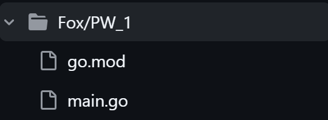
2. **Моделювання результатів:**
    - Описати структуру для збереження результату опитування адреси:
        - URL-адреса ресурсу (`string`);
        - HTTP-статус код відповіді (`int`);
        - тривалість виконання запиту (`time.Duration`);
        - помилка у разі невдалого з'єднання (`error`).
     
     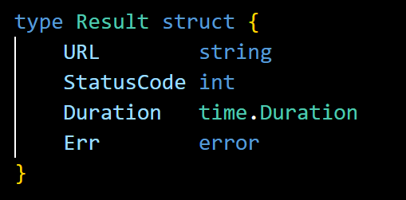
3. **Проєктування інтерфейсу та обробника:**
    - Оголосити інтерфейс для абстрагування операції перевірки ресурсу (контракт має приймати рядок URL та повертати структуру результату).
      
     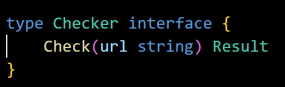
    - Створити структуру HTTP-клієнта з конфігурацією таймауту або внутрішнім полем клієнта.
      
     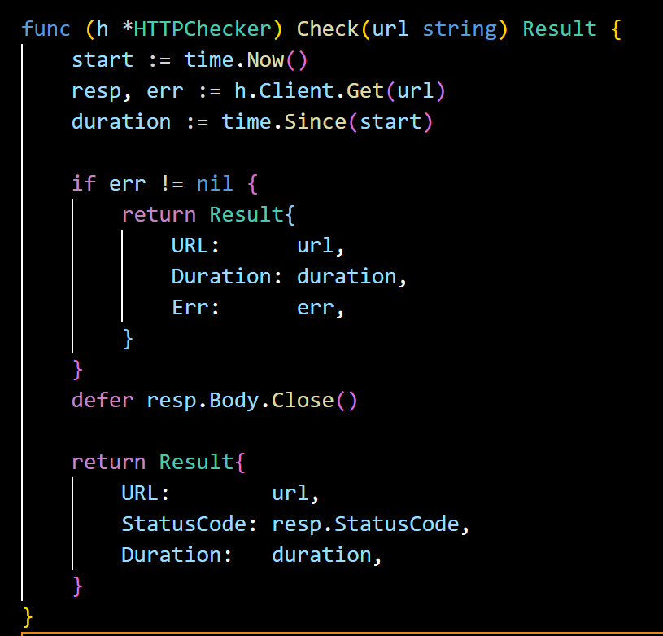
    - Реалізувати для цієї структури метод перевірки адреси (використати стандартний пакет `net/http` та функцію `http.Get` або метод `Do` власного клієнта `http.Client`).
      
     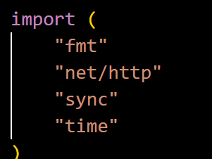
      
     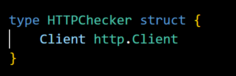
    - Усередині методу забезпечити точний замір тривалості виконання запиту за допомогою `time.Now()` та `time.Since()`.
      
     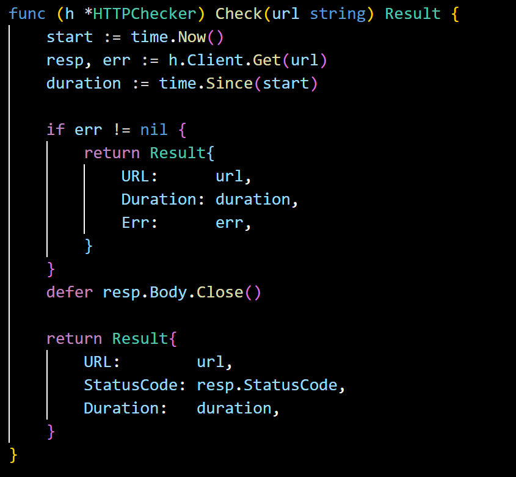
4. **Послідовний прогін:**
    - У функції `main()` сформувати зріз (`slice`) із 4–5 різних адрес (включно з 2–3 реальними сайтами, наприклад `https://go.dev`, `https://github.com`, а також завідомо некоректним або неіснуючим доменом для тестування відловлювання помилок).
      
     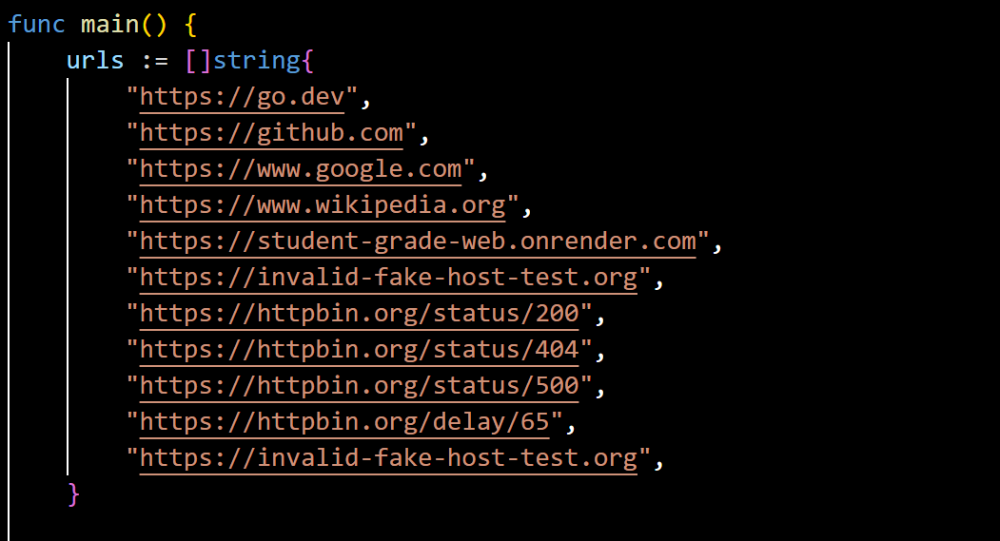
    - У послідовному циклі опитати всі URL через інтерфейс та вивести у термінал статус, тривалість і текст помилки (якщо є).
      
     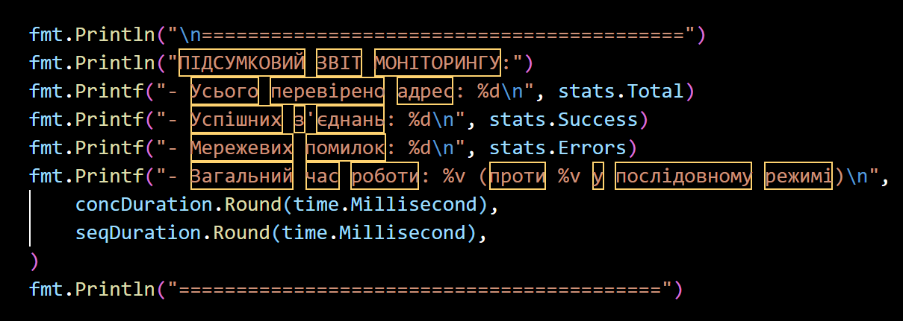
---

### Рівень 2. Конкурентний: горутини та захист спільного стану через Mutex

1. **Збереження функціональності Рівня 1.**
2. **Розпаралелювання запитів:**
    - Замість блокуючого послідовного циклу організувати запуск перевірки кожного URL в окремій легковажній горутині за допомогою ключового слова `go`.
    - Звернути особливу увагу на коректну передачу поточної адреси всередину анонімної функції горутини (уникнення замикання змінної циклу).
3. **Координація завершення горутин:**
    - Використати примітив синхронізації `sync.WaitGroup`, щоб головний потік програми дочекався закінчення опитування всіх серверів і не завершився завчасно.
    - Забезпечити коректне збільшення лічильника перед запуском кожної горутини та виклик зменшення лічильника всередині горутини (бажано через `defer`).
4. **Збір агрегованої статистики та ліквідація стану гонитви:**
    - Оголосити спільну структуру для підрахунку підсумкової статистики (наприклад: загальна кількість перевірених адрес, кількість успішних відповідей зі статусом 200, кількість помилок).
    - Оскільки горутини модифікують спільні лічильники одночасно, забезпечити захист критичної секції за допомогою `sync.Mutex` (методи `Lock()` та `Unlock()`).
    - Перевірити програму на відсутність стану гонитви пам'яті за допомогою прапорця:
        ```bash
        go run -race .
        ```
     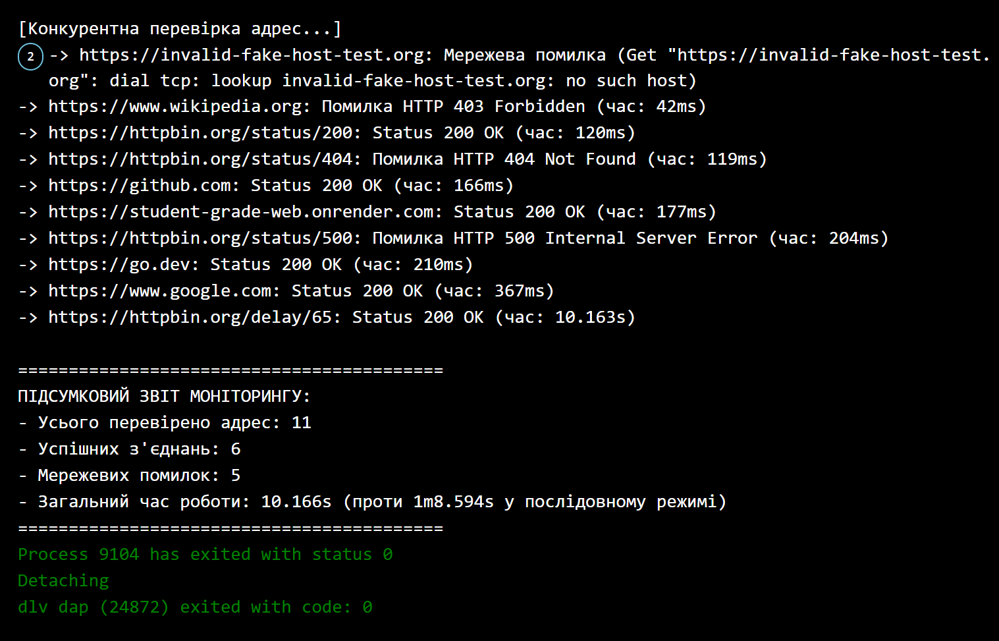
---

### Рівень 3. Просунутий: асинхронний збір результатів через канали

1. **Збереження функціональності попередніх рівнів.**
2. **Перехід до передачі даних через канали:**
    - Замість безпосереднього оновлення спільних лічильників через м'ютекс створити канал для передачі структур результатів із горутин.
    - Після виконання перевірки горутина повинна відправити отриману структуру результату в цей канал.
3. **Організація життєвого циклу каналу:**
    - Запустити окрему допоміжну горутину-координатор, яка очікує завершення всіх обчислень через `sync.WaitGroup.Wait()` і одразу після цього безпечно закриває канал результатів за допомогою функції `close()`.
4. **Обробка потоку результатів у головному потоці:**
    - У функції `main()` організувати вичитування всіх результатів із закритого каналу за допомогою конструкції `for res := range resultsChan`.
    - Здійснити підрахунок успішних/неуспішних результатів та вивести підсумковий структурований звіт моніторингу.
5. **Порівняльний аналіз продуктивності:**
    - Виміряти та вивести сумарний час роботи послідовного опитування (з Рівня 1) та паралельного опитування (з Рівня 3).
    - Зафіксувати кратне прискорення виконання завдання при конкурентному підході.
     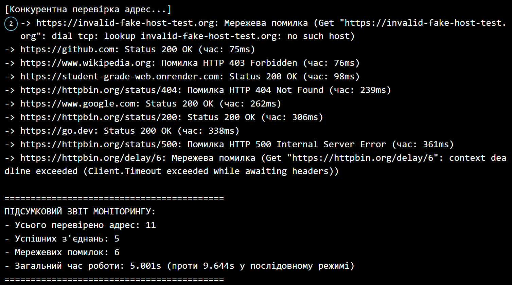


       
